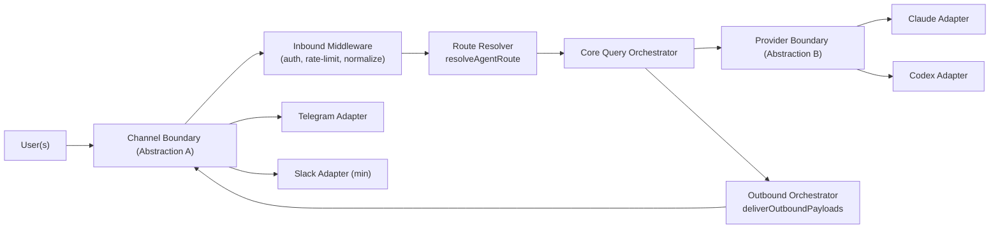

# SOMA Architecture Refactor v3.1 — ADR Applied Final

## 0. Status
- 상태: **Decision Freeze Complete**
- 기준 문서: `docs/ADR.md` (55/55 결정 확정)
- 이 문서는 기존 v3 질문 초안을 대체하는 **실행 기준 문서**다.

---

## 1. Locked Constraints
1. 기존 테스트는 레포 전체에서 삭제 후 재작성한다. (`T-01=C`, `T-02=A`)
2. 핵심 경계는 2단 abstraction으로 고정한다.
   - User(s) -> Abstraction A (Channel Boundary) -> soma/soul Core
   - soma/soul Core -> Abstraction B (Provider Boundary) -> Model Providers
3. `soma-work`는 지금 병합하지 않고, Slack + 멀티테넌트 최소 지원이 가능한 계약으로 설계한다.
4. OpenClaw 계약명/필드명과 최대한 동일하게 맞춰 복사 호환(copy-compatible) 수준을 목표로 한다.
5. 마이그레이션은 Big-bang으로 진행하며 dual-path를 두지 않는다. (`M-01=B`, `M-04=A`)

---

## 2. ADR Snapshot (Applied)

### 2.1 Test Strategy (T)
- 범위: 레포 전체 테스트 삭제 후 재작성
- 러너: Bun test 유지
- Mock: 수동 mock
- 순서: domain pure 먼저
- 커버리지: domain95/service85/adapter70
- 테스트 타입: 유닛/통합만 (E2E 제외)
- 회귀 기준: golden 스냅샷
- CI gate: test + typecheck + lint

### 2.2 Abstraction A (A)
- 멀티채널 인터페이스를 기본으로 설계
- 입력 공통 스키마에 thread/reply/locale 포함
- thread는 first-class key
- 순서 기준은 server timestamp
- interrupt는 절대 최우선(큐 우회)
- 출력은 단일 OutputPort + discriminated `type`
- reaction/keyboard는 Port 계약에 포함
- callback은 도메인 command로 파싱 후 전달
- 스트리밍은 push callback
- auth/rate-limit 책임은 inbound middleware

### 2.3 soma/soul Boundary (S)
- soma의 soul write는 allowlist 제한
- memory analyzer/updater는 soul adapter 계층으로 이동
- prompts/identity source of truth는 soul 우선
- restart/save context 파일은 soma 내부만 사용
- soul 보안 경계는 read-only 기본

### 2.4 Abstraction B (P)
- Provider 범위: Claude + Codex
- 이벤트 스키마: text/tool/usage + session/context/rate-limit 포함
- capability 계약: boolean flags 최소화
- mid-stream injection: optional
- tool safety: core hook chain
- rate-limit fallback: provider orchestrator
- model selection: provider boundary 밖 전략 서비스
- session resume: provider 공통 contract
- usage telemetry: normalized DTO
- 오류 taxonomy: 세분화 (rate_limit/auth/network/tool/abort 등)
- retry/backoff: provider별 정책
- permission mode: core query policy

### 2.5 Migration & Integration (M/W)
- Big-bang rewrite, 즉시 전환, dead code 즉시 제거
- tenantId required
- session key: `tenant:channel:thread`
- storage partition key: `tenant/channel/thread`
- working directory: per-thread (`{tenant}/{channel}/{thread}/`)
- Slack 최소 지원: text/thread + status/reaction
- 비병합 반영: feature flag + skeleton adapter
- `soma`↔`soma-work` 동기화: contract test

---

## 3. Final Target Architecture



### 3.1 Abstraction A Contract (Final)
- 필수 식별자: `tenantId`, `channelId`, `threadId`, `userId`, `messageId`, `timestamp`
- 인바운드 규칙:
  - 입력은 channel adapter에서 공통 envelope로 정규화
  - interrupt는 queue bypass
  - auth/rate-limit은 adapter 진입점에서 차단
- 아웃바운드 규칙:
  - 단일 OutputPort에 `type`으로 payload 분기
  - `text`, `status`, `reaction`, `choice/keyboard`를 공통 이벤트로 취급

### 3.2 Abstraction B Contract (Final)
- 공통 API:
  - `startQuery`
  - `streamEvents`
  - `abortQuery`
  - `resumeSession`
- 이벤트 모델:
  - `text`, `tool`, `usage`, `done`, `session`, `context`, `rate_limit`
- 보안/품질 규칙:
  - tool safety는 core hook chain에서 통합 관리
  - provider별 retry/backoff는 orchestrator에서 라우팅
  - usage는 normalized DTO로만 core에 전달

### 3.3 OpenClaw Compatibility Profile
- 정렬 대상 계약명:
  - `ChannelPlugin`
  - `ChannelOutboundAdapter`
  - `resolveAgentRoute`
  - `deliverOutboundPayloads`
  - `ModelApi`
- 정렬 대상 필드:
  - `accountId`, `peer`, `parentPeer`, `teamId`, `guildId`, `sessionKey`, `mainSessionKey`
- 상세 매핑: `docs/openclaw-compatibility-v3.md`

### 3.4 soma-work Compatibility Profile (Non-Merge)
- 채널 매핑 규칙:
  - Telegram 일반채팅 <-> Slack DM 1:1
  - Telegram 그룹방 <-> Slack 채널
  - Telegram 그룹 thread <-> Slack 채널 thread
- 권한 모델:
  - tenant allowlist
  - interrupt는 initiator 우선 + owner override

---

## 4. Execution Plan (Big-bang)
1. Decision freeze 적용 (완료)
2. OpenClaw 호환 계약 스켈레톤 생성
3. Provider boundary 구현 (Claude+Codex) — `M-02=C`
4. Channel boundary 구현 (Telegram 우선 + Slack skeleton)
5. Outbound orchestrator 중앙화
6. 레거시 handler/session 경로 제거 (단계별 즉시 삭제)
7. 테스트 전면 재작성
8. quality gate 통과: test + typecheck + lint

롤백 원칙:
- dual-path는 두지 않는다.
- 실패 시 git revert로 전체 단위 되돌림.

---

## 5. Test Reset Plan (Applied)

### 5.1 Reset
- 레포 전체 테스트 파일 삭제
- 기존 flaky 관용 없음 (0%)

### 5.2 Rebuild Order
1. Domain tests (pure)
2. Service tests (port orchestration)
3. Adapter integration tests

### 5.3 Quality Gates
- `bun test`
- `bun run typecheck`
- `make lint`

---

## 6. Directory Plan (TO-BE)

```text
src/
├─ channels/
│  ├─ dock.ts
│  └─ plugins/
│     ├─ types.core.ts
│     ├─ types.adapters.ts
│     ├─ types.plugin.ts
│     ├─ telegram.ts
│     └─ slack.ts
├─ routing/
│  ├─ resolve-route.ts
│  └─ session-key.ts
├─ core/
│  ├─ query-orchestrator.ts
│  ├─ tool-safety-chain.ts
│  └─ model-selection-strategy.ts
├─ providers/
│  ├─ types.models.ts
│  ├─ orchestrator.ts
│  ├─ claude-adapter.ts
│  └─ codex-adapter.ts
├─ infra/outbound/
│  └─ deliver.ts
└─ adapters/
   ├─ telegram/
   └─ slack/
```

---

## 7. Legacy Plan Handling
- 아래 2개 계획은 v3에 의해 superseded 상태로 유지한다.
  - v2 Hexagonal plan (`soma-zl7u`)
  - message-processing refactor (`soma-701o`)
- v3 구현 완료 시 해당 범위는 자동 해소로 간주한다.

---

## 8. References
- 결정 소스: `docs/ADR.md`
- 호환 설계: `docs/openclaw-compatibility-v3.md`
- Clarify 상세 기록: `docs/clairfy/INDEX.md`
