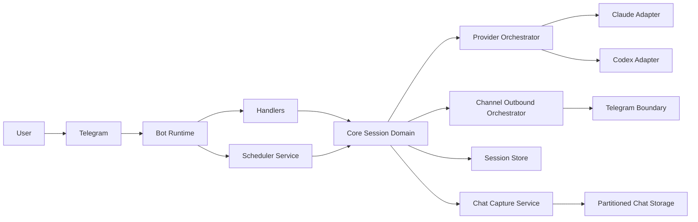
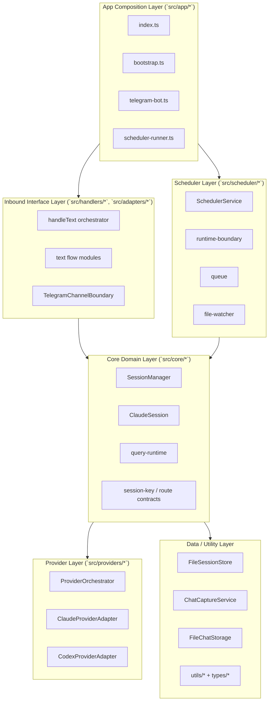
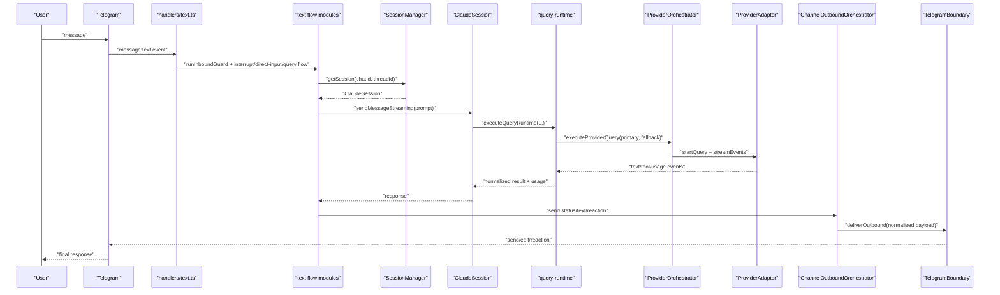
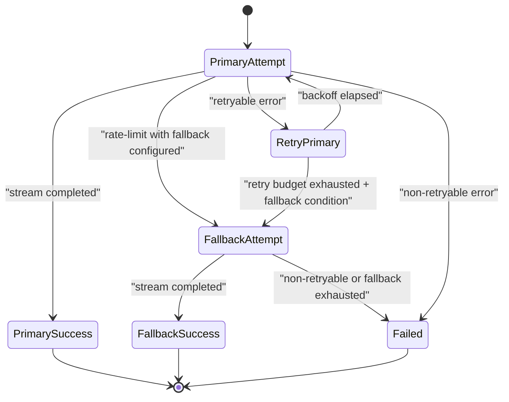
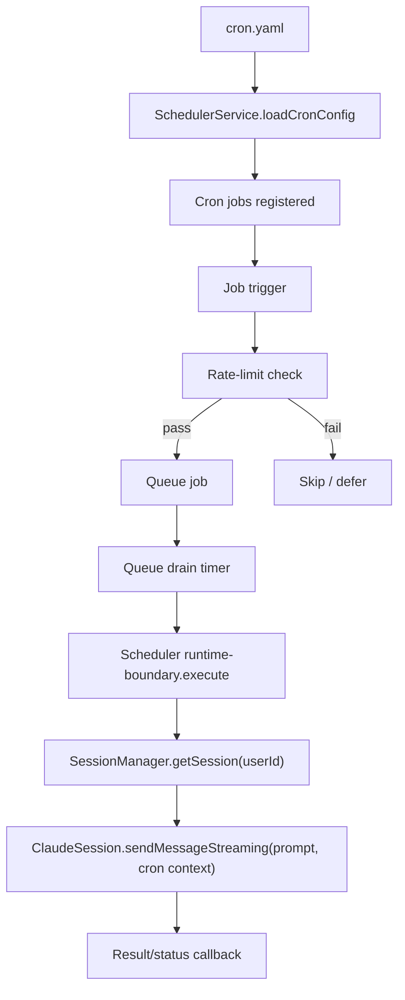
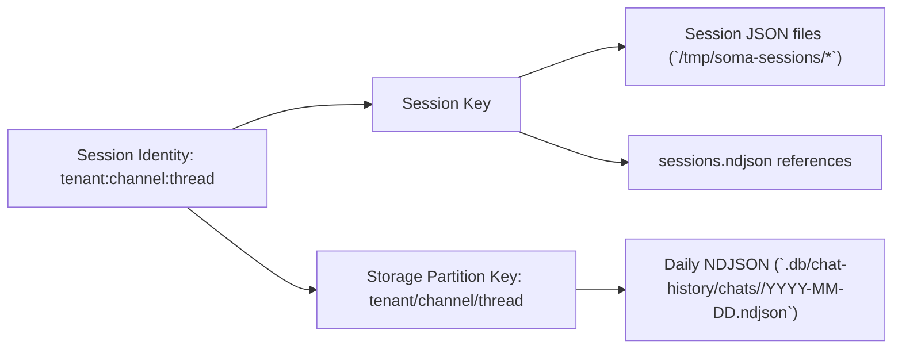

# SOMA Current Source Architecture (2026-02-10)

기준: `main` branch, refactor-reset(`soma-zfz`) 반영 이후 구조.

## 1) System Context

## 2) Layered Boundary View

## 3) Text Message Runtime Sequence

## 4) Provider Fallback State

## 5) Scheduler Execution Path

## 6) Persistence and Partition Model

## 7) Current Directory Ownership

- `src/app/*`
  - 프로세스 부팅, bot wiring, scheduler wiring.
- `src/handlers/*`
  - Telegram inbound 이벤트 처리 orchestration.
- `src/core/session/*`
  - 세션 상태머신, 질의 실행, 세션 라이프사이클.
- `src/core/routing/*`
  - 세션/스토리지 키 규약(tenant:channel:thread).
- `src/providers/*`
  - 모델 어댑터 및 retry/fallback orchestrator.
- `src/adapters/*`, `src/channels/*`
  - 채널 boundary 정책과 outbound payload dispatch/normalize.
- `src/scheduler/*`
  - cron 로드, 큐/워처/실행 orchestration.
- `src/storage/*`, `src/services/*`
  - chat/summary 저장 및 캡처/검색 서비스.
- `src/types/*`, `src/utils/*`
  - 도메인별 타입과 유틸리티 분리.

## 8) Compatibility Notes

- 삭제 완료된 legacy root modules:
  - `src/config.ts`
  - `src/model-config.ts`
  - `src/session.ts`
  - `src/session-manager.ts`
  - `src/scheduler.ts`
  - `src/utils.ts`
- 유지 중인 compatibility exports:
  - `src/routing/session-key.ts` -> `src/core/routing/session-key.ts`
  - `src/routing/resolve-route.ts` -> `src/core/routing/resolve-route.ts`
  - `src/types.ts` -> `src/types/*` barrel export

## 9) Entry Points

- Application boot: `src/index.ts` -> `src/app/bootstrap.ts`
- Text runtime path: `src/handlers/text.ts` -> `src/handlers/text/query-flow.ts` -> `src/core/session/session.ts` -> `src/core/session/query-runtime.ts`
- Scheduler runtime path: `src/app/scheduler-runner.ts` -> `src/scheduler/service.ts` -> `src/scheduler/runtime-boundary.ts` -> `src/core/session/session-manager.ts`
