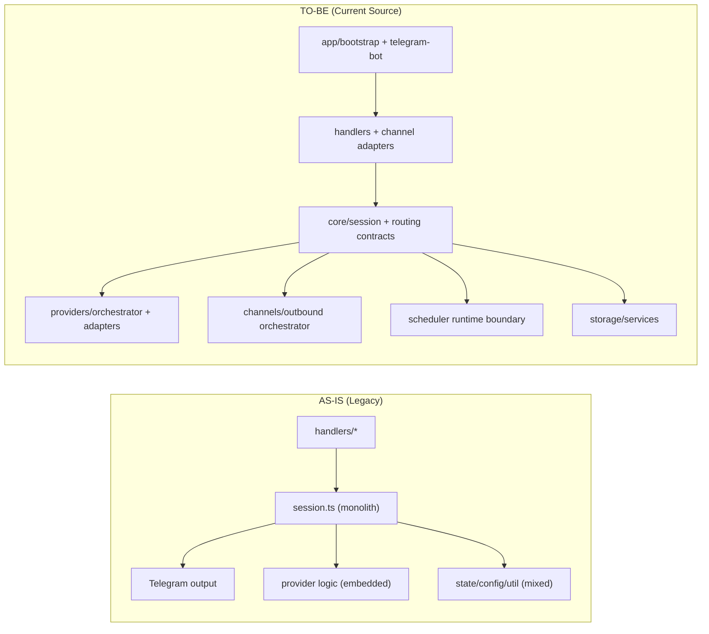
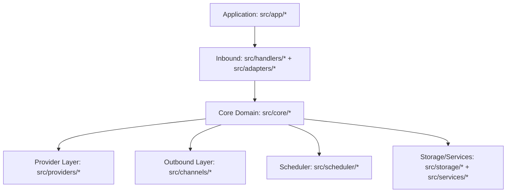

# SOMA Refactor Executive Summary

Updated: 2026-02-10  
Scope: `soma-zfz` reset refactor, current `main` source baseline

## Executive Summary

- Runtime architecture moved from handler/session 중심 결합 구조에서 명시적 경계 기반 구조로 전환되었다.
- 채널 경계는 Telegram 활성 + Slack skeleton optional 형태로 계약이 고정되었다.
- 모델 실행은 provider boundary + orchestrator(재시도/폴백)로 분리되어 Anthropic 기본, Codex opt-in 구조가 되었다.
- 기존 대형 root 모듈(`src/config.ts`, `src/session.ts`, `src/session-manager.ts`, `src/scheduler.ts`, `src/model-config.ts`, `src/utils.ts`)은 제거되고 도메인별 모듈로 재편되었다.

## AS-IS vs TO-BE

| 관점 | AS-IS (Refactor 이전) | TO-BE (현재 main) |
|---|---|---|
| 진입 구조 | `src/index.ts` + 대형 핸들러 중심 | `src/app/bootstrap.ts` + `src/app/telegram-bot.ts` 조립 |
| 세션/쿼리 | 단일 대형 `session.ts` 중심 | `src/core/session/*`로 상태/런타임/보조 로직 분리 |
| 채널 경계 | Telegram 처리와 로직 결합 | `src/adapters/telegram/*` 정책 분리 + outbound boundary |
| 다중 채널 | 실질 Telegram 전용 | Slack skeleton 계약(`src/adapters/slack/channel-skeleton.ts`) 포함 |
| 프로바이더 | 실행 로직 내부 결합 | `src/providers/*` + `ProviderOrchestrator` + retry/fallback |
| 모델 설정 | 단일 루트 설정 파일 중심 | `src/config/model.ts` + context별 모델/추론 레벨 |
| 스케줄러 | 루트 모듈 결합형 | `src/scheduler/*` + runtime boundary 분리 |
| 아키텍처 문서 | 계획/실행 문서 혼재 | current spec/architecture + archive/reference 분리 |

## Visual Comparison

## Current Layer Map

## Outcome Snapshot

- 구조적 결합 감소:
  - 채널 정책(auth/rate-limit/order), provider 전략(retry/fallback), scheduler 실행 경계가 분리되었다.
- 확장성 확보:
  - Codex provider opt-in, Slack skeleton boundary를 기존 구조에 손상 없이 수용할 수 있다.
- 문서 체계 정리:
  - 운영 기준 문서(`spec.md`, `specs.md`, `current-source-architecture.md`)와 과거 자료(`archive/`, `reference/`)가 분리되었다.

## Canonical References

- `/Users/icedac/2lab.ai/soma/docs/spec.md`
- `/Users/icedac/2lab.ai/soma/docs/specs.md`
- `/Users/icedac/2lab.ai/soma/docs/architecture/current-source-architecture.md`
- `/Users/icedac/2lab.ai/soma/docs/spec.ssot.md`
