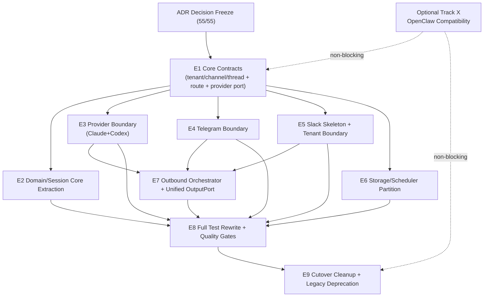
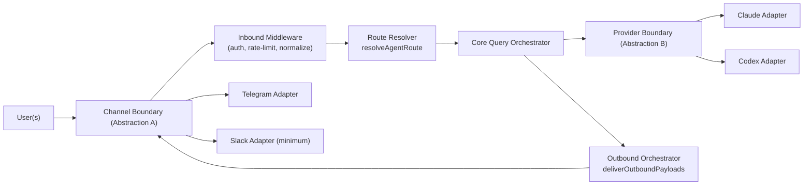
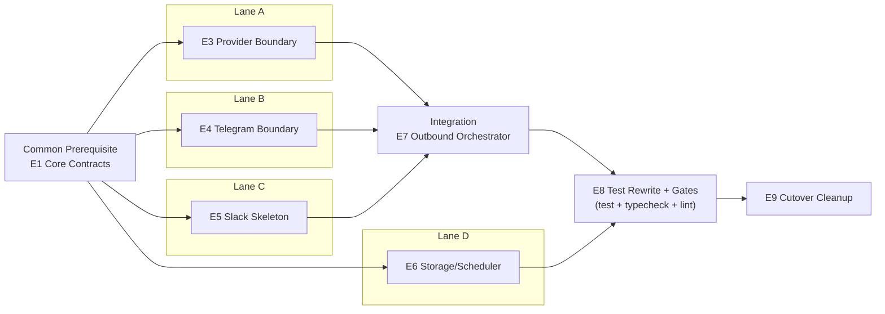
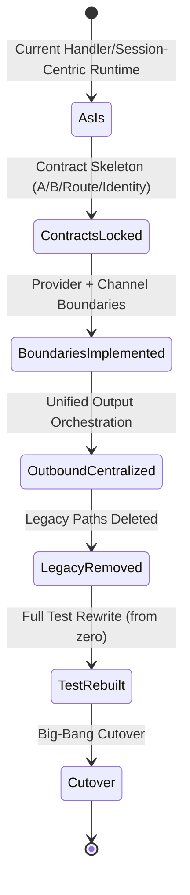
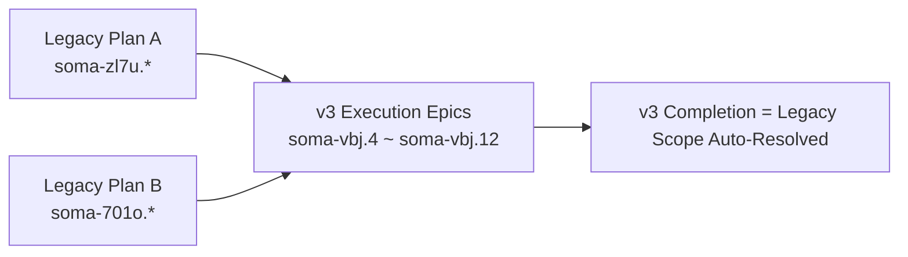
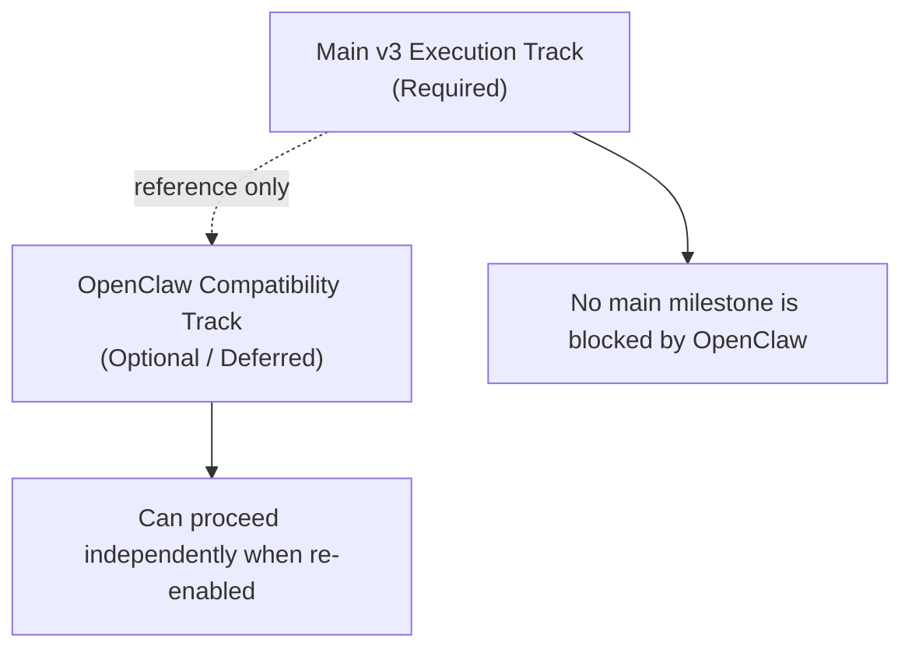

# SOMA Refactor v3 - Master Visualization

이 문서는 v3 리팩토링의 전체 실행 계획을 다이어그램으로 한 번에 볼 수 있도록 정리한 시각화 문서다.

## 1) Master Plan (Scope + Execution)

## 2) Target Runtime Architecture (To-Be)

## 3) Team Parallelization Plan

## 4) Migration Strategy (Big-Bang)

## 5) Legacy Plan Supersede Map

## 6) Optional OpenClaw Separation Rule

