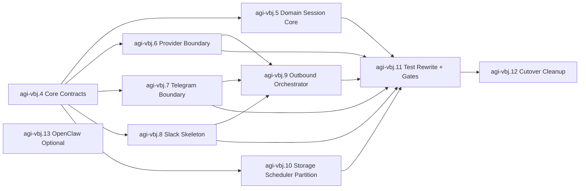

# Refactor v3 Issue Plan (OpenClaw Separated)

## 0. Scope
- 메인 v3 리팩토링은 OpenClaw 호환 트랙을 분리한 상태로 진행한다.
- OpenClaw는 `agi-vbj.13` (optional/deferred)로 격리되어 메인 경로를 block하지 않는다.
- 전체 시각화 다이어그램은 `docs/refactor-v3-visualization.md`를 참조한다.

## 1. Execution Epics
- `agi-vbj.4` v3-exec-1: core contracts foundation
- `agi-vbj.5` v3-exec-1b: domain/session-core extraction
- `agi-vbj.6` v3-exec-2: provider boundary (claude+codex orchestrator)
- `agi-vbj.7` v3-exec-3: telegram channel boundary refactor
- `agi-vbj.8` v3-exec-4: slack skeleton + tenant boundary
- `agi-vbj.9` v3-exec-5: outbound orchestration + unified output port
- `agi-vbj.10` v3-exec-6: storage/scheduler partition refactor
- `agi-vbj.11` v3-exec-7: full test rewrite + quality gates
- `agi-vbj.12` v3-exec-8: cutover cleanup + legacy deprecation
- `agi-vbj.13` v3-track-x: optional openclaw compatibility (deferred)

## 2. Dependency Graph

## 3. Parallel Work Allocation
- Team A: `agi-vbj.6` Provider
- Team B: `agi-vbj.7` Telegram
- Team C: `agi-vbj.8` Slack skeleton
- Team D: `agi-vbj.10` Storage/Scheduler
- Integration Team: `agi-vbj.9` -> `agi-vbj.11` -> `agi-vbj.12`

## 4. Deprecation Candidates (User Confirmation Required)

아래 이슈는 `soma-zl7u`/`soma-701o`가 이미 superseded 상태라, 새 v3 에픽으로 대체 가능하다.

### Group A: `soma-zl7u.*` (10 tasks)
- `soma-zl7u.1`, `soma-zl7u.2`, `soma-zl7u.3`, `soma-zl7u.4`, `soma-zl7u.5`
- `soma-zl7u.6`, `soma-zl7u.7`, `soma-zl7u.8`, `soma-zl7u.9`, `soma-zl7u.10`

### Group B: `soma-701o.*` (5 tasks)
- `soma-701o.1`, `soma-701o.2`, `soma-701o.3`, `soma-701o.4`, `soma-701o.5`

제안 처리:
- 상태를 deprecated/superseded 처리하고, 대체 에픽 `agi-vbj.4`~`agi-vbj.12`에 링크
- 세부 구현 지식이 필요한 항목은 코멘트로 migration mapping 남긴 뒤 close
