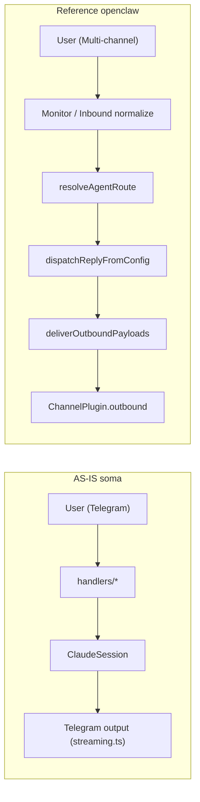
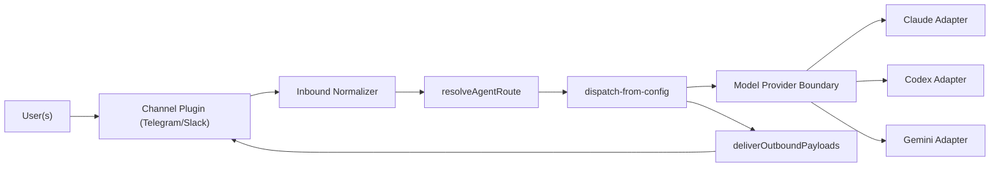

# SOMA v3 OpenClaw Compatibility Blueprint (Optional / Deferred)

> Deferred reference track.  
> This document is historical context and may not match current source paths.

## 0. Goal
- 목적: `openclaw`의 채널/라우팅/아웃바운드/모델 프로바이더 계약과 **이름·필드 수준 호환**을 맞춰, 코드 재사용을 복붙 수준으로 끌어올린다.
- 비목표: 지금 당장 `soma` + `soma-work` + `openclaw`를 단일 런타임으로 합치는 것.
- 상태: **메인 v3 리팩토링 범위에서 분리됨 (deferred track)**.

---

## 1. Evidence (실제 확인 소스)

### 1.1 OpenClaw 문서 및 핵심 계약
- `/Users/zhugehyuk/2lab.ai/openclaw/docs/concepts/architecture.md`
- `/Users/zhugehyuk/2lab.ai/openclaw/src/channels/plugins/types.plugin.ts`
- `/Users/zhugehyuk/2lab.ai/openclaw/src/channels/plugins/types.adapters.ts`
- `/Users/zhugehyuk/2lab.ai/openclaw/src/channels/dock.ts`
- `/Users/zhugehyuk/2lab.ai/openclaw/src/channels/plugins/outbound/load.ts`
- `/Users/zhugehyuk/2lab.ai/openclaw/src/routing/resolve-route.ts`
- `/Users/zhugehyuk/2lab.ai/openclaw/src/routing/session-key.ts`
- `/Users/zhugehyuk/2lab.ai/openclaw/src/auto-reply/reply/dispatch-from-config.ts`
- `/Users/zhugehyuk/2lab.ai/openclaw/src/infra/outbound/deliver.ts`
- `/Users/zhugehyuk/2lab.ai/openclaw/src/config/types.models.ts`
- `/Users/zhugehyuk/2lab.ai/openclaw/src/agents/models-config.providers.ts`
- `/Users/zhugehyuk/2lab.ai/openclaw/extensions/telegram/src/channel.ts`
- `/Users/zhugehyuk/2lab.ai/openclaw/extensions/slack/src/channel.ts`
- `/Users/zhugehyuk/2lab.ai/openclaw/src/plugins/runtime/types.ts`
- `/Users/zhugehyuk/2lab.ai/openclaw/src/plugins/runtime/index.ts`

### 1.2 SOMA 현재 구조
- `/Users/zhugehyuk/2lab.ai/soma/src/index.ts`
- `/Users/zhugehyuk/2lab.ai/soma/src/session.ts`
- `/Users/zhugehyuk/2lab.ai/soma/src/session-manager.ts`
- `/Users/zhugehyuk/2lab.ai/soma/src/handlers/text.ts`
- `/Users/zhugehyuk/2lab.ai/soma/src/handlers/streaming.ts`
- `/Users/zhugehyuk/2lab.ai/soma/src/config.ts`
- `/Users/zhugehyuk/2lab.ai/soma/src/types.ts`

### 1.3 soma-work 참고 구조 (Slack + 멀티유저/스레드)
- `/Users/zhugehyuk/2lab.ai/soma-work/src/index.ts`
- `/Users/zhugehyuk/2lab.ai/soma-work/src/slack-handler.ts`
- `/Users/zhugehyuk/2lab.ai/soma-work/src/claude-handler.ts`
- `/Users/zhugehyuk/2lab.ai/soma-work/src/session-registry.ts`
- `/Users/zhugehyuk/2lab.ai/soma-work/src/working-directory-manager.ts`
- `/Users/zhugehyuk/2lab.ai/soma-work/src/types.ts`
- `/Users/zhugehyuk/2lab.ai/soma-work/docs/architecture.md`

---

## 2. AS-IS Directory Structure

### 2.1 SOMA (현재)
```text
src/
├─ index.ts                    # Telegram bootstrap + wiring + scheduler start
├─ session.ts                  # Claude SDK 실행 + 상태 + fallback (대형)
├─ session-manager.ts          # chat/thread 세션 관리
├─ handlers/
│  ├─ text.ts                  # 인증/응답/choice/steering/에러 처리 복합
│  ├─ commands.ts
│  ├─ callback.ts
│  ├─ voice.ts photo.ts document.ts
│  └─ streaming.ts             # Telegram 출력 렌더링/편집
├─ services/                   # memory/chat/summary 등 기능별 서비스
├─ security.ts
├─ config.ts
└─ types.ts
```

### 2.2 soma-work (참고)
```text
src/
├─ slack-handler.ts            # Slack facade + 파이프라인 오케스트레이션
├─ claude-handler.ts           # Claude facade + session registry 위임
├─ session-registry.ts         # channel+thread 키 중심 세션 상태머신
├─ slack/                      # event/command/stream/action 모듈 분리
└─ working-directory-manager.ts# BASE_DIRECTORY/{userId}
```

### 2.3 OpenClaw (호환 타겟)
```text
src/
├─ channels/
│  ├─ dock.ts
│  └─ plugins/
│     ├─ types.plugin.ts
│     ├─ types.adapters.ts
│     └─ outbound/load.ts
├─ routing/
│  ├─ resolve-route.ts
│  └─ session-key.ts
├─ auto-reply/reply/dispatch-from-config.ts
├─ infra/outbound/deliver.ts
├─ config/types.models.ts
└─ plugins/runtime/{types.ts,index.ts}
extensions/
├─ telegram/src/channel.ts
└─ slack/src/channel.ts
```

---

## 3. Architecture Comparison



핵심 차이:
- `soma`는 handler+session 중심 단일 흐름.
- `openclaw`는 채널 경계/라우팅/아웃바운드가 계약으로 분리되어 재사용성이 높다.

---

## 4. Gap Matrix (복사 호환 관점)

| 영역 | OpenClaw 기준 | SOMA 현재 | 호환 갭 |
|---|---|---|---|
| 채널 경계 | `ChannelPlugin` + adapter facet | Telegram handler 직접 결합 | 큼 |
| 라우팅 | `resolveAgentRoute(cfg, channel, accountId, peer...)` | `sessionManager.deriveKey(chatId, threadId)` | 큼 |
| 세션 키 | `agent/channel/account/peer` 조합 + scope | `chatId[:threadId]` | 큼 |
| 인바운드 표준화 | 채널별 context -> 공통 finalized context | handler마다 수동 분기 | 중간~큼 |
| 아웃바운드 | `deliverOutboundPayloads` 중앙화 | `ctx.reply/edit` 분산 | 큼 |
| 프로바이더 경계 | `ModelApi` + provider config + event policy | `session.ts` 내부 fallback/분기 | 큼 |
| 확장 런타임 | `setXRuntime` + `registerChannel` | 없음 | 큼 |
| 멀티테넌트 | `teamId/guildId/accountId` 라우팅 수용 | user/group allowlist 중심 | 중간~큼 |
| Slack 최소지원 | channel plugin + threading/action contract | 별도 repo(`soma-work`) | 큼 |

---

## 5. TO-BE Directory Profile (Copy-Compatible)

```text
src/
├─ channels/
│  ├─ dock.ts
│  ├─ session.ts
│  └─ plugins/
│     ├─ types.core.ts
│     ├─ types.adapters.ts
│     ├─ types.plugin.ts
│     ├─ outbound/load.ts
│     ├─ telegram.ts
│     └─ slack.ts              # 최소 지원
├─ routing/
│  ├─ resolve-route.ts
│  └─ session-key.ts
├─ auto-reply/
│  └─ reply/
│     ├─ dispatch-from-config.ts
│     └─ inbound-context.ts
├─ infra/
│  └─ outbound/
│     └─ deliver.ts
├─ providers/
│  ├─ types.models.ts
│  ├─ registry.ts
│  └─ claude|codex|gemini-adapters/*
├─ plugins/
│  └─ runtime/
│     ├─ types.ts
│     └─ index.ts
└─ adapters/
   ├─ telegram/
   └─ slack/
extensions/
├─ telegram/
└─ slack/
```



### 설계 원칙 (복붙 효율 우선)
1. `ChannelPlugin`, `ChannelOutboundAdapter`, `resolveAgentRoute`, `deliverOutboundPayloads`, `ModelApi` 명칭 유지.
2. 필드 이름을 OpenClaw와 동일하게 유지:
   `accountId`, `peer`, `parentPeer`, `teamId`, `guildId`, `sessionKey`, `mainSessionKey`.
3. Telegram/Slack 어댑터는 포트 구현체로 내리고, core는 해당 타입만 참조.
4. 기존 `handlers/*`는 점진적으로 얇은 adapter facade로 축소.

---

## 6. soma-work 고려 통합 규칙 (비병합)

1. 세션 키 설계는 `W-02`, 저장소 partition은 `W-07`에서 고정한다.
2. `soma-work`의 `channel+thread` shared session 모델을 유지할 수 있도록 `thread`를 first-class로 둔다.
3. `WorkingDirectoryManager`의 `BASE_DIRECTORY/{userId}` 패턴을 v3 storage adapter 설계에 수용한다.
4. Slack 최소 지원은 v3에서 `text + thread`를 baseline으로 두고, reaction/interactive는 capability flag로 확장한다.

---

## 7. Phased Integration Plan

### Phase 0 — Contract Skeleton
- 산출물: `channels/plugins/types.*`, `routing/*`, `providers/types.models.ts`
- 목표: 이름/필드 레벨 호환 계약 우선 고정
- 관련 결정: `A-02`, `A-03`, `P-02`, `W-02`

### Phase 1 — Telegram to ChannelPlugin
- 산출물: Telegram inbound/outbound를 `ChannelPlugin`으로 분리
- 목표: 기존 Telegram 기능 회귀 없이 경계 분리
- 관련 결정: `A-01`, `A-06`, `A-10`

### Phase 2 — Central Outbound
- 산출물: `deliverOutboundPayloads` 유사 오케스트레이터
- 목표: `handlers/streaming.ts`의 채널 특화 송신 분산 제거
- 관련 결정: `A-06`, `W-06`, `M-02`

### Phase 3 — Provider Boundary
- 산출물: `ModelApi`/capability/normalized usage/error taxonomy
- 목표: `session.ts`의 provider 분기 제거
- 관련 결정: `P-01`~`P-12`

### Phase 4 — Slack Minimum Adapter
- 산출물: Slack `text/thread` 중심 plugin + tenant 고려 식별자 수용
- 목표: `soma-work` 통합 가능성 확보 (비병합)
- 관련 결정: `W-01`, `W-05`, `W-08`, `W-09`

### Phase 5 — Extension Runtime
- 산출물: `setXRuntime`/`registerChannel` 패턴
- 목표: 채널 패키지 분리와 재사용성 확보
- 관련 결정: `W-09`, `W-10`, `M-01`

---

## 8. Copy-Candidate Modules (우선 재사용)

| OpenClaw 모듈 | 기대 재사용 방식 | 예상 수정량 |
|---|---|---|
| `types.plugin.ts`, `types.adapters.ts` | 타입 골격 거의 그대로 이식 | 100줄 미만 |
| `routing/resolve-route.ts` | 설정 스키마 맞춰 로직 이식 | 300줄 미만 |
| `routing/session-key.ts` | 키 규칙 일부 조정해 이식 | 300줄 미만 |
| `channels/plugins/outbound/load.ts` | registry 연결부만 조정 | 100줄 미만 |
| `infra/outbound/deliver.ts` | Soma payload 타입에 맞게 조정 | 500줄 미만 |
| `config/types.models.ts` | provider config 표준 타입으로 이식 | 100줄 미만 |
| `extensions/*/src/channel.ts` 패턴 | Telegram/Slack 어댑터 작성 템플릿으로 재사용 | 300줄 미만 |

---

## 9. ADR Applied Map (확정)

`docs/reference/adr-v3-legacy.md` 기준으로 OpenClaw 호환에 필요한 결정은 아래처럼 lock되었다.

- 채널 경계:
  - `A-01=B`, `A-02=B`, `A-03=B`, `A-06=B`, `A-07=A`, `A-10=A`
- 프로바이더 경계:
  - `P-01=B`, `P-02=B`, `P-03=A`, `P-09=B`, `P-10=B`
- 멀티테넌트/Slack:
  - `W-01=C`, `W-02=B`, `W-05=A`, `W-07=B`, `W-09=B`, `W-10=B`
- 실행 전략:
  - `M-01=B`, `M-02=C`, `M-04=A`

결론:
- OpenClaw 호환 스펙은 더 이상 “질문 대기” 상태가 아니라, 구현 가능한 고정 입력 상태다.
