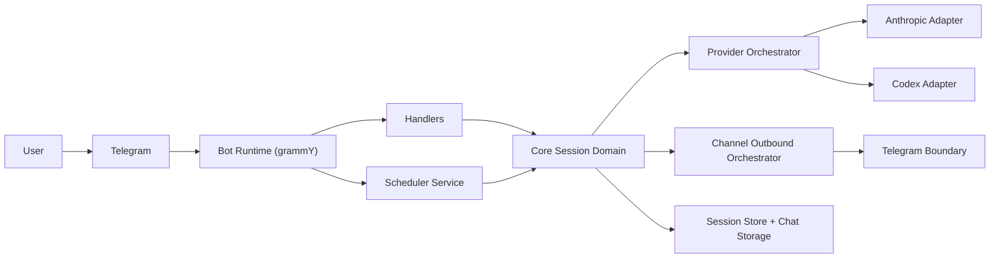
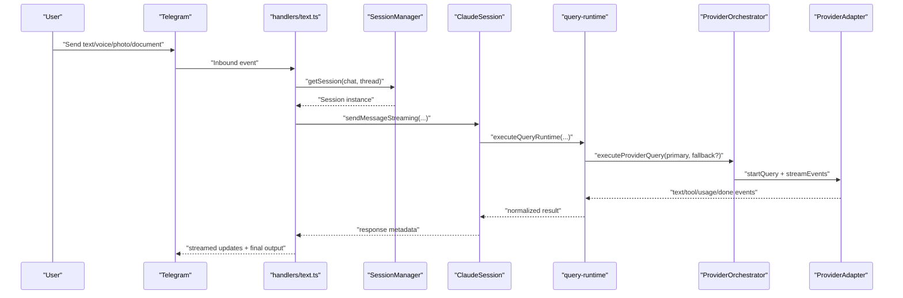

# SOMA System Specification (Current)

Updated: 2026-02-10  
Scope: `main` branch current runtime architecture

## 1. Purpose

SOMA is a Telegram-first AI agent runtime that:

- receives user input from chat channels,
- executes model queries through a provider boundary,
- streams tool/text/status output back to the channel,
- persists session and chat history for recovery and continuity.

## 2. Current Platform/Provider Scope

### Channels

| Channel | Status | Notes |
|---|---|---|
| Telegram | Active | Full inbound/outbound path, thread-aware, reactions/choices support |
| Slack | Skeleton (optional) | Contract-compatible boundary behind `SLACK_SKELETON_ENABLED=true` (`SLACK_ALLOWED_TENANTS` allowlist) |

### Providers

| Provider | Status | Notes |
|---|---|---|
| Anthropic (`ClaudeProviderAdapter`) | Active default | Primary runtime execution path |
| Codex (`CodexProviderAdapter`) | Integrated, opt-in | Adapter exists; enabled by `CODEX_PROVIDER_ENABLED=true` |

### Model Context Defaults

| Context | Model | Reasoning |
|---|---|---|
| `general` | Opus 4.6 | `high` |
| `summary` | Sonnet 4.5 | `minimal` |
| `cron` | Haiku 4.5 | `none` |

Source: `/Users/icedac/2lab.ai/soma/src/config/model.ts`

## 3. High-Level Architecture

## 4. Runtime Request Flow

## 5. Boundary Contracts

- Channel boundary contract: `/Users/icedac/2lab.ai/soma/src/channels/plugins/types.core.ts`
- Session identity contract: `/Users/icedac/2lab.ai/soma/src/core/routing/session-key.ts`
- Provider boundary contract: `/Users/icedac/2lab.ai/soma/src/providers/types.models.ts`
- Scheduler runtime boundary: `/Users/icedac/2lab.ai/soma/src/scheduler/runtime-boundary.ts`

## 6. Security and Safety Controls

- User/group allowlist + mention policy: `/Users/icedac/2lab.ai/soma/src/security.ts`
- Rate limiting (token bucket): `/Users/icedac/2lab.ai/soma/src/security.ts`
- Path allowlist enforcement and command safety checks: `/Users/icedac/2lab.ai/soma/src/security.ts`
- Provider/tool/runtime guardrails are enforced in query runtime hooks.

## 7. Canonical Deep-Dive Docs

- Technical deep spec: `/Users/icedac/2lab.ai/soma/docs/specs.md`
- Architecture diagrams: `/Users/icedac/2lab.ai/soma/docs/architecture/current-source-architecture.md`
- Refactor executive summary: `/Users/icedac/2lab.ai/soma/docs/architecture/refactor-executive-summary.md`
- Documentation SSOT policy: `/Users/icedac/2lab.ai/soma/docs/spec.ssot.md`
- Operations runbook: `/Users/icedac/2lab.ai/soma/docs/operations/service-runbook.md`
