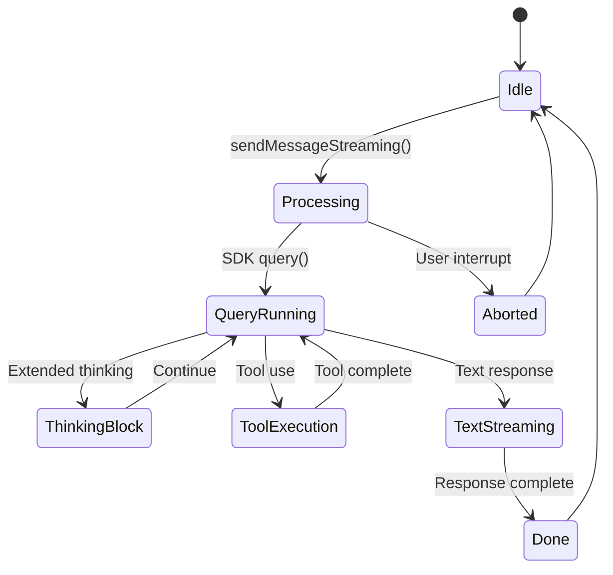

# Soma + P9 System Specification v3.0

**Version**: 3.0
**Last Updated**: 2026-02-05 09:30 GMT+9
**Based on**: 185 commits (2026-01-05 ~ 2026-02-05)
**SSOT Reference**: `docs/spec.ssot.md` (36개 User 지시 원본)

---

## Level 1: System Architecture Overview

```
┌─────────────────────────────────────────────────────────────────────────────┐
│                           ELON SYSTEM (2lab.ai)                              │
├─────────────────────────────────────────────────────────────────────────────┤
│                                                                             │
│  ┌─────────────────────────┐         ┌─────────────────────────────────┐   │
│  │        p9 (Soul)        │◄────────►│         soma (Body)             │   │
│  │   ~/2lab.ai/soul/p9     │         │    ~/2lab.ai/soma               │   │
│  ├─────────────────────────┤         ├─────────────────────────────────┤   │
│  │ • Identity (WHO AM I)   │         │ • TypeScript Codebase           │   │
│  │ • Memory (WHAT I KNOW)  │         │ • Telegram Bot Implementation   │   │
│  │ • Soul (HOW I BEHAVE)   │         │ • MCP Servers                   │   │
│  │ • Prompting Config      │         │ • Session Management            │   │
│  └─────────────────────────┘         └─────────────────────────────────┘   │
│                                                                             │
│  ┌─────────────────────────────────────────────────────────────────────┐   │
│  │                          External Systems                            │   │
│  ├─────────────────────────────────────────────────────────────────────┤   │
│  │ Telegram API │ Claude Agent SDK │ OpenAI Whisper │ MCP Protocol     │   │
│  └─────────────────────────────────────────────────────────────────────┘   │
│                                                                             │
└─────────────────────────────────────────────────────────────────────────────┘
```

### 1.1 System Identity

| Component | Role | Location | bd prefix |
|-----------|------|----------|-----------|
| **p9** | Soul/Mind - Identity, Memory, Philosophy | `~/2lab.ai/soul/p9` | `p9-*` |
| **soma** | Body - Code, Communication, Process | `~/2lab.ai/soma` | `soma-*` |

### 1.2 Core Concept: Mind-Body Separation

```yaml
p9 (ψυχή/psyche):
  Purpose: WHO AM I?
  Contents: IDENTITY.md, MEMORY.md, SOUL.md, CLAUDE.md
  Persistence: Markdown files, curated by AI

soma (σῶμα/soma):
  Purpose: HOW DO I WORK?
  Contents: TypeScript, handlers, services
  Persistence: Code + runtime state
```

### 1.3 Two Types of Restart

| Type | Trigger | Scope | Session ID | Mechanism |
|------|---------|-------|------------|-----------|
| **Service Restart** | `make up` | soma (body) | Preserved | SIGTERM → restart-context-*.md |
| **Session Restart** | 180k context | p9 (mind) | New | /save → clear → /load |

---

## Level 2: Component Architecture

### 2.1 soma (Body) - File Tree

```
~/2lab.ai/soma/
├── src/
│   ├── index.ts              # Bot entry point (431 lines)
│   ├── session.ts            # Claude SDK wrapper (1241 lines) ★
│   ├── session-manager.ts    # Multi-session handling (391 lines)
│   ├── scheduler.ts          # Cron job queue (356 lines)
│   ├── config.ts             # Environment + MCP config (325 lines)
│   ├── security.ts           # Rate limiting, path validation
│   ├── usage.ts              # Token tracking (483 lines)
│   ├── formatting.ts         # Markdown → Telegram HTML (380 lines)
│   ├── model-config.ts       # Dynamic model selection
│   ├── bd-client.ts          # bd CLI integration
│   │
│   ├── handlers/
│   │   ├── commands.ts       # /start, /new, /stop, /model... (828 lines) ★
│   │   ├── text.ts           # Message processing (688 lines) ★
│   │   ├── streaming.ts      # Real-time updates (682 lines) ★
│   │   ├── callback.ts       # Inline button handling (506 lines)
│   │   ├── document.ts       # PDF, ZIP processing (545 lines)
│   │   ├── voice.ts          # Whisper transcription
│   │   ├── photo.ts          # Image handling
│   │   ├── media-group.ts    # Album buffering
│   │   └── index.ts
│   │
│   ├── services/
│   │   ├── skills-registry.ts      # Skill loading + callbacks (377 lines)
│   │   ├── conversation-reader.ts  # p9 history reading (383 lines)
│   │   ├── memory-analyzer.ts      # Learning extraction (297 lines)
│   │   ├── memory-updater.ts       # Atomic CLAUDE.md updates
│   │   ├── claude-md-updater.ts    # Section-based diffs (247 lines)
│   │   ├── summary-generator.ts    # Haiku-powered summaries
│   │   ├── chat-capture-service.ts # Real-time chat logging
│   │   ├── chat-search-service.ts  # History search
│   │   └── retention-cleanup.ts    # Storage management (297 lines)
│   │
│   ├── storage/
│   │   ├── chat-storage.ts         # NDJSON chat persistence
│   │   └── summary-storage.ts      # Summary persistence (256 lines)
│   │
│   ├── stores/
│   │   └── pending-form-store.ts   # Multi-form state
│   │
│   ├── types/
│   │   ├── user-choice.ts          # UIAskUserQuestion types
│   │   ├── chat-history.ts
│   │   └── pending-forms.ts
│   │
│   └── utils/
│       ├── user-choice-extractor.ts     # JSON choice parsing
│       ├── telegram-choice-builder.ts   # Inline keyboard generation
│       └── error-classification.ts
│
├── mcp-servers/
│   └── chat-history/
│       └── server.ts         # MCP server for chat history access
│
├── docs/
│   ├── spec.md               # This file
│   ├── specs.md              # Legacy v1.0 spec
│   └── ...
│
├── mcp-config.ts             # MCP server configuration
├── model-config.yaml         # Model preferences
└── package.json              # Dependencies
```

**Total**: ~12,000 lines TypeScript (excluding tests)

### 2.2 p9 (Soul) - File Tree

```
~/2lab.ai/soul/p9/
├── CLAUDE.md          # Main prompting config (19,709 chars) ★
├── BOOT.md            # Startup instructions
├── IDENTITY.md        # WHO AM I
├── CONTEXT.md         # WHERE AM I RUNNING
├── SOUL.md            # HOW DO I BEHAVE
├── MEMORY.md          # WHAT DO I REMEMBER
├── HEARTBEAT.md       # Cron check instructions
├── TOOLS.md           # Available tools documentation
├── AGENTS.md          # Agent system documentation
│
├── USER/
│   ├── MEMO.txt              # Compressed conversation summary
│   ├── MEMORY_SYSTEM.md      # Memory tier rules
│   └── history/
│       ├── YYYY-MM-DD.md     # Daily logs
│       ├── YYYY-MM.md        # Monthly summaries
│       └── YYYY.md           # Yearly summaries
│
├── SYSTEM/
│   ├── rp/
│   │   ├── RP.txt            # RP state
│   │   └── state.json        # Simulation state
│   └── memories/
│       └── URGENT_MESSAGE_TO_FUTURE_ELON.md
│
├── ZETTEL/                   # L6+ abstract concepts (Zettelkasten)
│   └── 000_index.md
│
├── .claude/
│   └── chat_logs/            # Conversation history (2026-01-03 ~ present)
│       ├── 2026-01-XX/
│       ├── 2026-02-XX/
│       └── ...
│
├── cron.yaml                 # Scheduled jobs config
├── model-config.yaml         # Model selection
├── scripts/
│   ├── bd-verify             # Verification workflow
│   └── bd-close-verified     # Close with verification
│
└── PROJECTS/, ESSAYS/, PAPERS/, ARCHIVE/, ARTIFACTS/
```

### 2.3 Feature Matrix (since v1.0)

| Feature | Module | Added | Description |
|---------|--------|-------|-------------|
| **UIAskUserQuestion** | handlers/callback, types/user-choice | 2026-01-20 | JSON-based inline keyboards |
| **Skills Registry** | services/skills-registry | 2026-01-25 | Skill loading + /skills command |
| **Chat History MCP** | mcp-servers/chat-history | 2026-01-28 | get_chats, search_chats tools |
| **Summary Generator** | services/summary-generator | 2026-01-26 | Haiku-powered auto-summaries |
| **Memory Analyzer** | services/memory-analyzer | 2026-01-26 | LLM learning extraction |
| **Real-time Steering** | handlers/streaming | 2026-01-22 | PreToolUse/PostToolUse hooks |
| **/model Command** | handlers/commands | 2026-02-01 | Dynamic model switching |
| **Context Tracking** | usage.ts | 2026-01-30 | Context window % display |
| **Multi-session** | session-manager.ts | 2026-01-29 | Multiple concurrent sessions |
| **SIGTERM Handler** | index.ts | 2026-01-27 | Graceful restart with context save |
| **bd Integration** | bd-client.ts | 2026-01-21 | bd CLI wrapper |

---

## Level 2.5: User Requirements (SSOT-Based)

> **Source**: `spec.ssot.md` Z-1 ~ Z-36 (2026-02-03 ~ 2026-02-05)

### Implemented Features

| SSOT | Feature | Status | Module |
|------|---------|--------|--------|
| Z-7, Z-8 | UIAskUserQuestion | ✅ Done | handlers/callback, types/user-choice |
| Z-11 | Context-rich questions | ✅ Done | CLAUDE.md prompting |
| Z-15 | Real-time steering | ✅ Done | handlers/streaming |
| Z-20 | Skills system (/skills) | ✅ Done | services/skills-registry |
| Z-22 | Model display | ✅ Done | handlers/commands |
| Z-27 | Chat History API | ✅ Done | mcp-servers/chat-history |

### Partially Implemented

| SSOT | Feature | Status | Notes |
|------|---------|--------|-------|
| Z-13 | p9/soma docs | 🔶 Partial | spec.md exists, needs memory link |
| Z-23 | Interrupt system | 🔶 Partial | /stop works, steering pending |
| Z-25 | Error log collection | 🔶 Partial | Basic logging, UI incomplete |

### Open Bugs

| SSOT | Bug | Status | Notes |
|------|-----|--------|-------|
| Z-29 | MCP call failure | 🔴 Open | Works in terminal, fails in soma |
| Z-28 | bd + MCP conflict | 🟡 Needs verify | Core functionality working |

### Pending Features

| SSOT | Feature | Priority |
|------|---------|----------|
| Z-20 | Skill register/unregister UI | P2 |
| Z-23 | Full interrupt AS-IS/TO-BE | P1 |

---

## Level 3: Implementation Details

### 3.1 Core Flow: Message Processing

```
User → Telegram → grammY → Handler Selection → Security Check → ClaudeSession → Response
        │                      │                    │               │
        │                      ├── /command?        ├── Rate Limit  ├── SDK query()
        │                      ├── text?            ├── Auth Check  ├── Streaming
        │                      ├── voice?           └── Path Valid  ├── Tools
        │                      ├── photo?                           └── Steering
        │                      └── document?
```

### 3.2 Session Lifecycle



### 3.3 UIAskUserQuestion Flow

```
Claude Response
    │
    ▼
JSON Detection (```json block)
    │
    ├── type: "user_choice" (single)
    │       │
    │       ▼
    │   TelegramChoiceBuilder
    │       │
    │       ▼
    │   InlineKeyboard [Option A] [Option B]
    │
    └── type: "user_choices" (multi)
            │
            ▼
        Progressive Form UI
            │
            ▼
        Question 1 → Answer → Question 2 → Answer → Submit

User clicks button
    │
    ▼
Callback: c:{sessionKey}:{optionId}
    │
    ▼
handleChoiceCallback()
    │
    ▼
Selection sent to Claude as new message
```

### 3.4 Steering System

```typescript
// PreToolUse Hook - Before tool execution
onPreToolUse: (toolName, input) => {
  // Inject steering message if pending
  if (steeringPending) {
    return { injectMessage: steeringContent }
  }
}

// PostToolUse Hook - After tool execution
onPostToolUse: (toolName, output) => {
  // Buffer steering messages
  if (toolName === 'TodoWrite') {
    updateTodoDisplay(output)
  }
}
```

### 3.5 MCP Server: chat-history

```typescript
// Available Tools
get_chats(pointDate, lastN, afterN, type)
  → Returns messages/summaries around a point in time

get_chats_by_dates(from, to, limit, type)
  → Returns all messages in date range

get_chats_count_by_dates(from, to)
  → Returns count (check before large queries)

search_chats(from, to, searchTerm, lastN, afterN)
  → Keyword search within date range
```

### 3.6 Skills Registry

```typescript
// Registration (on bot startup)
registerSkill('my-skill', {
  name: 'my-skill',
  description: 'What this skill does',
  onCallback: async (args) => {
    // Handle skill invocation
    return { response: '...' }
  }
})

// User invocation
/skills              → Show available skills
Skill("my-skill")    → Invoke skill
```

### 3.7 Memory System (Multi-Tier)

```
Tier 1: USER/MEMO.txt (MAX 500 lines)
    ↓ Overflow
Tier 2: USER/history/YYYY-MM-DD.md (daily logs)
    ↓ Monthly compress
Tier 3: USER/history/YYYY-MM.md (MAX 1000 lines)
    ↓ Yearly compress
Tier 4: USER/history/YYYY.md (MAX 1000 lines)
```

### 3.8 Security Layers (6 Layers)

```
Layer 1: User Allowlist (TELEGRAM_ALLOWED_USERS)
Layer 2: Rate Limiting (Token bucket, 20/60s default)
Layer 3: Path Validation (ALLOWED_PATHS whitelist)
Layer 4: Command Safety (Block rm -rf, sudo rm, fork bomb, etc.)
Layer 5: System Prompt (SAFETY_PROMPT with delete confirmation)
Layer 6: Audit Logging (/tmp/soma-audit.log)
```

---

## Appendix A: Commands Reference

| Command | Description | Handler |
|---------|-------------|---------|
| `/start` | Show status, user ID | commands.ts |
| `/new` | Start fresh session | commands.ts |
| `/stop` | Interrupt current query | commands.ts |
| `/status` | Current processing state | commands.ts |
| `/resume` | Resume last session | commands.ts |
| `/restart` | Restart bot process | commands.ts |
| `/retry` | Retry last message | commands.ts |
| `/context` | Show context usage | commands.ts |
| `/model` | Change model (inline buttons) | commands.ts |
| `/skills` | List available skills | commands.ts |
| `/help` | Show help | commands.ts |

## Appendix B: Environment Variables

| Variable | Required | Default | Description |
|----------|----------|---------|-------------|
| `TELEGRAM_BOT_TOKEN` | ✓ | - | Bot token from @BotFather |
| `TELEGRAM_ALLOWED_USERS` | ✓ | - | Comma-separated user IDs |
| `CLAUDE_WORKING_DIR` | - | `$HOME` | Working directory |
| `OPENAI_API_KEY` | - | - | For voice transcription |
| `ALLOWED_PATHS` | - | See config | File access whitelist |
| `ANTHROPIC_API_KEY` | - | - | For summary generation |

## Appendix C: MCP Servers

| Server | Purpose | Config |
|--------|---------|--------|
| `chat-history` | Query conversation history | Built-in |
| `gpt-as-mcp` | OpenAI Codex integration | oh-my-claude |
| `claude-as-mcp` | Claude sub-conversations | oh-my-claude |
| `gemini-as-mcp` | Gemini integration | oh-my-claude |

---

## Changelog

### v3.0 (2026-02-05)
- Added SSOT reference (`spec.ssot.md`)
- Added Level 2.5: User Requirements section
- Mapped 36 user instructions to feature status
- Added Open Bugs / Pending Features tracking

### v2.0 (2026-02-01)
- UIAskUserQuestion choice system (JSON → inline keyboards)
- Skills registry service + /skills command
- Chat history MCP server (get_chats, search_chats)
- Summary generator (Haiku-powered)
- Memory analyzer (learning extraction)
- Real-time steering (PreToolUse/PostToolUse hooks)
- /model command (dynamic model selection)
- Context window tracking in footer
- Multi-session support
- SIGTERM handler (graceful restart)
- bd CLI integration

### Bug Fixes (v1.0 → v2.0)
- Steering message injection timing
- Race conditions in activity state
- Interrupt system overhaul (INT-1 to INT-5)
- Context token persistence
- Skills registry silent failures

---

## SSOT Extraction Process

이 문서의 User Requirements 섹션은 다음 과정으로 추출됨:

1. `soul/p9/.claude/raw_logs/2026-02-*` 에서 type="user" 메시지 추출
2. `ssot_z_chats.json` (330개 메시지)
3. **수동으로 한 줄씩 읽고** 지시사항 판별 (프로그램 필터링 금지)
4. `ssot_z_1_task.json` ~ `ssot_z_36_task.json` 개별 저장
5. `spec.ssot.md` 통합 → 이 문서로 해석/번역

> "SSOT = Single Source of Truth = 원본 그대로"
> spec.ssot.md는 번역/해석/요약 없이 원본 기록.
> spec.md는 SSOT 기반 해석 문서.

---

**End of Specification v3.0**

*Reference: `docs/spec.ssot.md` for raw user instructions.*
