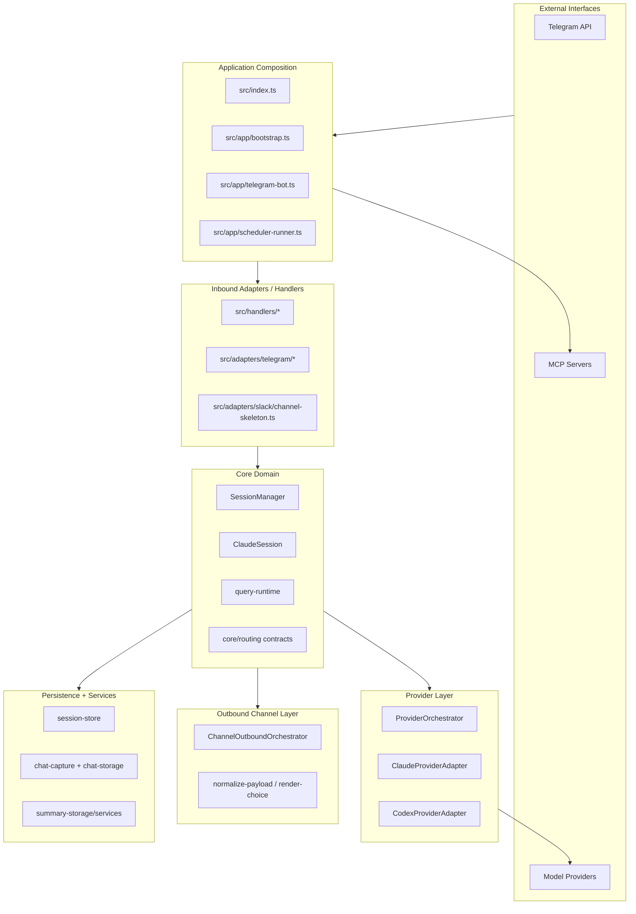
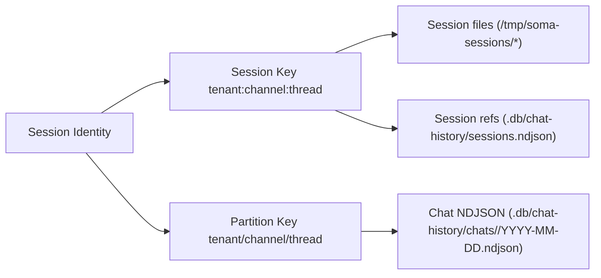

# SOMA Technical Specification (Detailed)

Updated: 2026-02-10  
Target: Current source tree after refactor-reset completion

## 1. System Boundaries



## 2. Module Ownership

| Area | Primary files | Responsibility |
|---|---|---|
| Boot/runtime composition | `src/app/bootstrap.ts`, `src/app/telegram-bot.ts`, `src/index.ts` | Process start, middleware registration, scheduler wiring, shutdown |
| Session lifecycle | `src/core/session/session.ts`, `src/core/session/session-manager.ts` | Session state, stop/interrupt, persistence lifecycle |
| Query execution runtime | `src/core/session/query-runtime.ts` | Provider/SDK event streaming, tool hooks, usage/context metadata |
| Routing identity | `src/core/routing/session-key.ts` | Canonical `tenant:channel:thread` identity and partition keys |
| Provider orchestration | `src/providers/orchestrator.ts`, `src/providers/create-orchestrator.ts` | Retry/fallback policy and provider execution dispatch |
| Channel boundaries | `src/adapters/telegram/channel-boundary.ts`, `src/adapters/slack/channel-skeleton.ts` | Inbound normalization + outbound delivery contract |
| Scheduler domain | `src/scheduler/service.ts`, `src/scheduler/runtime-boundary.ts` | Cron load, queue/watcher, runtime execution bridge |
| Storage services | `src/storage/*`, `src/services/chat-capture-service.ts` | Chat/summary persistence, context retrieval |

## 3. Channel Specifications

### 3.1 Telegram (Active)

- Boundary class: `TelegramChannelBoundary`
- Policies split:
  - auth: `src/adapters/telegram/auth-policy.ts`
  - rate-limit: `src/adapters/telegram/rate-limit-policy.ts`
  - ordering/interrupt bypass: `src/adapters/telegram/order-policy.ts`
- Outbound port: `src/adapters/telegram/outbound-port.ts`
- Supports:
  - thread-aware identity mapping
  - text/reaction/status/choice output (choice normalized to text in outbound layer)

### 3.2 Slack Skeleton (Deferred but integrated contract)

- File: `src/adapters/slack/channel-skeleton.ts`
- Enabled only when `SLACK_SKELETON_ENABLED=true`
- Enforces tenant allowlist (`SLACK_ALLOWED_TENANTS`)
- Runtime default is no-op outbound unless an explicit outbound port is wired.

## 4. Provider Specifications

### 4.1 Orchestrator

- Class: `ProviderOrchestrator`
- Input chain: `primaryProviderId` + optional `fallbackProviderId`
- Retry policy source:
  - default: `src/providers/retry-policy.ts`
  - override via `PROVIDER_RETRY_POLICIES_JSON`
- Composer entry:
  - `src/providers/create-orchestrator.ts` registers Claude + Codex adapters

### 4.2 Anthropic Provider (Primary)

- Adapter: `src/providers/claude-adapter.ts`
- Capabilities:
  - resume: yes
  - tool streaming: yes
  - mid-stream injection: yes
- Emits normalized provider events:
  - `session`, `text`, `tool`, `usage`, `context`, `rate_limit`, `done`

### 4.3 Codex Provider (Integrated Optional)

- Adapter: `src/providers/codex-adapter.ts`
- Enabled by `CODEX_PROVIDER_ENABLED=true`
- Default capabilities:
  - resume: no
  - tool streaming: no
  - mid-stream injection: no

## 5. Model and Reasoning Configuration

Model config source:

- `src/config/model.ts`
- file-backed config: `model-config.yaml`

Default context mapping:

- `general` -> `claude-opus-4-6` + `high`
- `summary` -> `claude-sonnet-4-5-20250929` + `minimal`
- `cron` -> `claude-haiku-4-5-20251001` + `none`

Reasoning budget levels:

- `none`, `minimal`, `medium`, `high`, `xhigh` mapped to token budgets.

## 6. Runtime Data Model and Persistence



## 7. Scheduler Execution Contract

- Scheduler service:
  - loads `cron.yaml`
  - validates prompt size and schedule schema
  - manages queue + file watcher + lock/rate limits
- Runtime bridge:
  - `configureSchedulerRuntime` injects `isBusy()` and `execute()`
  - execution delegates to `SessionManager.getSession(user).sendMessageStreaming(...)`

## 8. Quality Gates (Current Contract)

- `make lint`
- `make test` (with default env fallback inside Makefile)
- `bun run typecheck`

Coverage execution (when needed):

```bash
TELEGRAM_BOT_TOKEN=dummy TELEGRAM_ALLOWED_USERS=1 \
bun test --coverage --coverage-reporter=text --coverage-reporter=lcov \
  --coverage-dir coverage/all
```

E2E-only coverage:

```bash
TELEGRAM_BOT_TOKEN=dummy TELEGRAM_ALLOWED_USERS=1 \
bun test src/e2e --coverage --coverage-reporter=text --coverage-reporter=lcov \
  --coverage-dir coverage/e2e
```

Operational details:

- `/Users/icedac/2lab.ai/soma/docs/operations/service-runbook.md`

## 9. Current Deferred/Optional Tracks

- Slack production wiring: contract exists, full adapter runtime integration deferred.
- Multi-provider routing policy tuning: codex path integrated but not default route.
- Existing lint warnings (`no-explicit-any`) tracked as technical debt cleanup.
